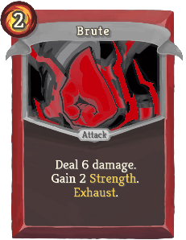
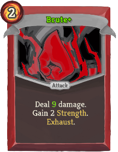
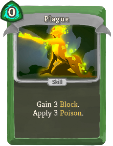
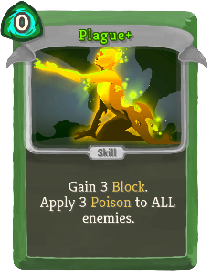
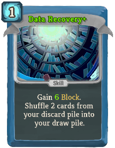
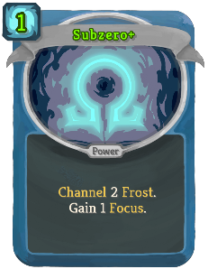
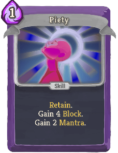
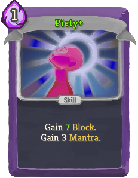
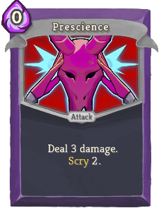

| Name |⠀Image | Image+ | Rarity | Type | Cost | Description |
| ---- | ----- | -------------- | ------ | ---- | ---- | ----------- |
| Brute |  |  | Basic | Attack | 2 | Deal 6 (10) damage. Gain 2 Strength. Exhaust. |
| Cowardice |  |  | Basic | Skill | 1 | Gain 8 (11) Block. Add 1 Dazed to your draw pile and hand. |
| Plague |  |  | Basic | Skill | 0 | Gain 3 Block. Apply 3 Poison (to ALL enemies). |
| Stab And Strike |  |  | Basic | Attack | 1 | Deal 4 (7) damage. Add 1 Shiv to your hand. |
| Data Recovery |  |  | Basic | Skill | 1 | Gain 4 (7) Block. Shuffle 2 cards from your discard pile into your draw pile. |
| Subzero |  |  | Basic | Power | 2 (1) | Channel 2 Frost. Gain 1 Focus. |
| Piety |  |  | Basic | Skill | 1 | Gain 4 (7) Block. Gain 3 Mantra. |
| Prescience |  |  | Basic | Attack | 0 | Deal 4 (5) damage. Scry 2 (3). |
