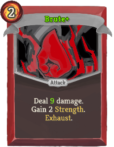

| Name | Image | Upgraded image | Rarity | Type | Cost | Description |
| ---- | ----- | -------------- | ------ | ---- | ---- | ----------- |
| Brute |  |  | Basic | Attack | 2 | Deal 10(12) damage. Gain 1(2) Strength. Exhaust. |
| Cowardice |  |  | Basic | Skill | 1 | Gain 8(10) Block. Add 1 *Dazed to your draw pile (and hand). |
| Plague |  |  | Basic | Skill | 0 | Gain 3 Block. Apply 3 Poison (to ALL enemies). |
| Stab And Strike |  |  | Basic | Attack | 1 | Deal 5(8) damage. Add 1 Shiv to your hand. |
| Data Recovery |  |  | Basic | Skill | 1 | Gain 4(6) Block. Move 1(2) card(s) from your discard pile to your draw pile. |
| Subzero |  |  | Basic | Power | 2(1) | Channel 2 Frost. Gain 1 Focus. |
| Piety |  |  | Basic | Skill | 1 | Gain 5(7) Block. Gain 2(3) Mantra. |
| Prescience |  |  | Basic | Attack | 1 | Deal 7(8) damage. Scry 3(4). |
